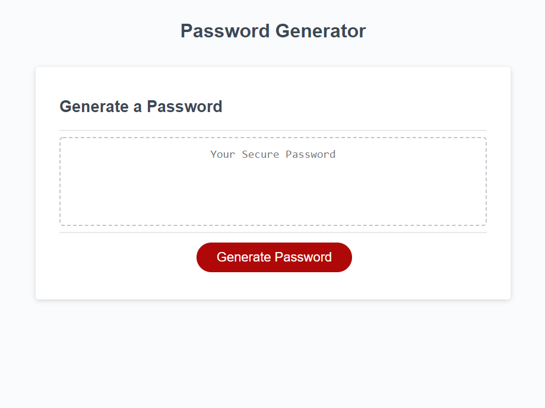

# Password Generator
URL to this repository https://github.com/LifeInvaderr/Password-Generator

URL to the deployed repositry https://lifeinvaderr.github.io/Password-Generator/

## Description
With Password Generator, users are able to create a randomly generated password.

## Table of Contents
* [Technologies](#technologies)
* [Installation](#installation)
* [Usage](#usage)
* [Questions](#questions)
 
## Technologies
* Javascript
* HTML5
* CSS

## Installation
To install this repostiry, please their clone or install the zip version

Once installed, open the index.html within a browser to intialize the question prompt

## Usage
With password generator, users can create a randomly generated password after prompted with a series of questions such as character lenght, to character types.

## Questions

For any questions or concerns, please email me at matthewkausfox@gmail.com

Thank you!